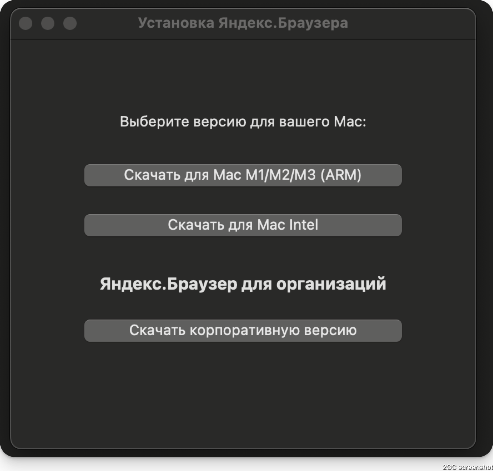
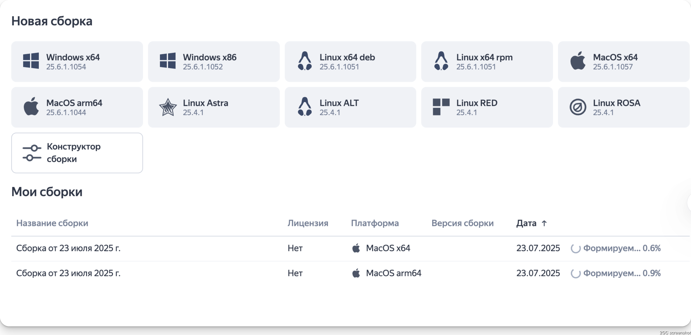
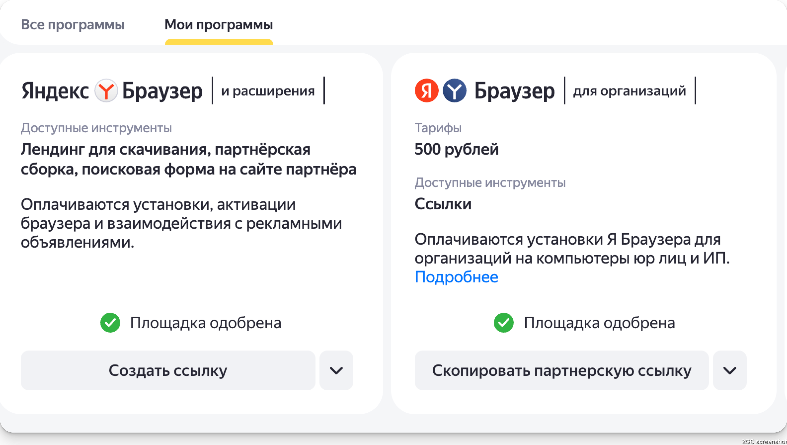

# Yandex Browser Mac Downloader



Простое нативное приложение-обёртка для macOS, позволяющее пользователю выбрать и скачать подходящую версию Яндекс.Браузера для Mac (ARM/M1/M2/M3 или Intel).

## Возможности
- Показывает окно с выбором архитектуры (ARM или Intel)
- Открывает официальную партнёрскую ссылку для скачивания нужного дистрибутива Яндекс.Браузера
- Упаковано в .dmg для удобного распространения

---

## Варианты сборки

### 1. Яндекс.Браузер и расширения

Это стандартная версия Яндекс.Браузера для пользователей Mac, которую мы реализовали в этом проекте. Приложение-обёртка позволяет выбрать архитектуру и скачать нужный дистрибутив браузера с поддержкой партнёрских ссылок.

- Скачать браузер можно по ссылке: [https://browser.yandex.ru/download?partner_id=831050&banerid=1312898233](https://browser.yandex.ru/download?partner_id=831050&banerid=1312898233)
  - Параметр `partner_id=831050` — ваш партнёрский идентификатор.

### 2. Яндекс.Браузер для организаций

Для корпоративных клиентов Яндекс предоставляет специальную версию браузера с возможностью самостоятельной сборки установщика и интеграции с корпоративной инфраструктурой.

- Скачать корпоративную версию можно по ссылке: [https://browser.yandex.ru/corp/builds?refid=5931838](https://browser.yandex.ru/corp/builds?refid=5931838)
  - Параметр `refid=5931838` — ваш партнёрский код.
- Клиент самостоятельно формирует сборку программы для установки через веб-интерфейс.



---

## Как получить партнёрскую ссылку

1. Перейдите в личный кабинет Яндекс.Дистрибуции: [https://distribution.yandex.ru/v2/cpa/offers](https://distribution.yandex.ru/v2/cpa/offers)
2. Найдите нужное предложение и нажмите кнопку **"Скопировать партнёрскую ссылку"**.



## Сборка

Для сборки приложения требуется Swift и macOS 10.13+.

1. Клонируйте репозиторий:
   ```sh
   git clone https://github.com/yourname/yandex-browser-mac-downloader.git
   cd yandex-browser-mac-downloader/YandexBrowserInstallerApp
   ```
2. Соберите приложение:
   ```sh
   swift build -c release
   ```
3. Соберите .app вручную (если нужно):
   ```sh
   mkdir -p ../dist/YandexBrowserInstaller.app/Contents/MacOS
   cp .build/release/YandexBrowserInstaller ../dist/YandexBrowserInstaller.app/Contents/MacOS/
   # Добавьте Info.plist, если нужно (пример в репозитории)
   ```
4. Упакуйте в .dmg:
   ```sh
   cd ..
   hdiutil create -volname "YandexBrowserInstall" -srcfolder dist/YandexBrowserInstaller.app -ov -format UDZO dist/YandexBrowserInstall.dmg
   ```

## Использование

1. Откройте `dist/YandexBrowserInstall.dmg`.
2. Запустите `YandexBrowserInstaller.app`.
3. Выберите нужную архитектуру — откроется страница загрузки Яндекс.Браузера для вашей платформы.

## Партнёрские ссылки

В приложении используются официальные партнёрские ссылки Яндекса для отслеживания установок.

## Лицензия

MIT License. 