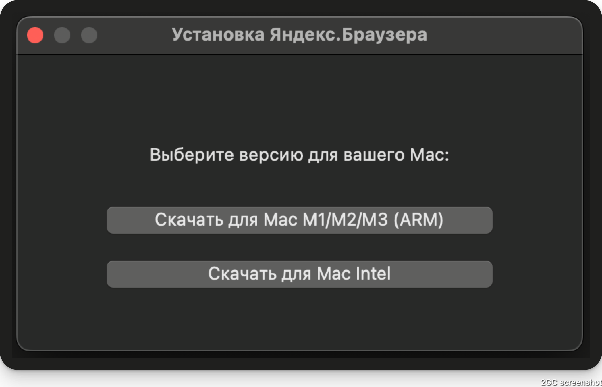

# Yandex Browser Mac Downloader




Простое нативное приложение-обёртка для macOS, позволяющее пользователю выбрать и скачать подходящую версию Яндекс.Браузера для Mac (ARM/M1/M2/M3 или Intel).

## Возможности
- Показывает окно с выбором архитектуры (ARM или Intel)
- Открывает официальную партнёрскую ссылку для скачивания нужного дистрибутива Яндекс.Браузера
- Упаковано в .dmg для удобного распространения

## Сборка

Для сборки приложения требуется Swift и macOS 10.13+.

1. Клонируйте репозиторий:
   ```sh
   git clone https://github.com/yourname/yandex-browser-mac-downloader.git
   cd yandex-browser-mac-downloader/YandexBrowserInstallerApp
   ```
2. Соберите приложение:
   ```sh
   swift build -c release
   ```
3. Соберите .app вручную (если нужно):
   ```sh
   mkdir -p ../YandexBrowserInstallerDisk/YandexBrowserInstaller.app/Contents/MacOS
   cp .build/release/YandexBrowserInstaller ../YandexBrowserInstallerDisk/YandexBrowserInstaller.app/Contents/MacOS/
   # Добавьте Info.plist, если нужно (пример в репозитории)
   ```
4. Упакуйте в .dmg:
   ```sh
   cd ..
   hdiutil create -volname "YandexBrowserInstall" -srcfolder YandexBrowserInstallerDisk -ov -format UDZO YandexBrowserInstall.dmg
   ```

## Использование

1. Откройте `YandexBrowserInstall.dmg`.
2. Запустите `YandexBrowserInstaller.app`.
3. Выберите нужную архитектуру — откроется страница загрузки Яндекс.Браузера для вашей платформы.

## Партнёрские ссылки

В приложении используются официальные партнёрские ссылки Яндекса для отслеживания установок.

## Лицензия

MIT License.